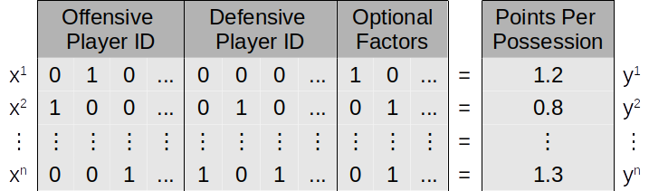
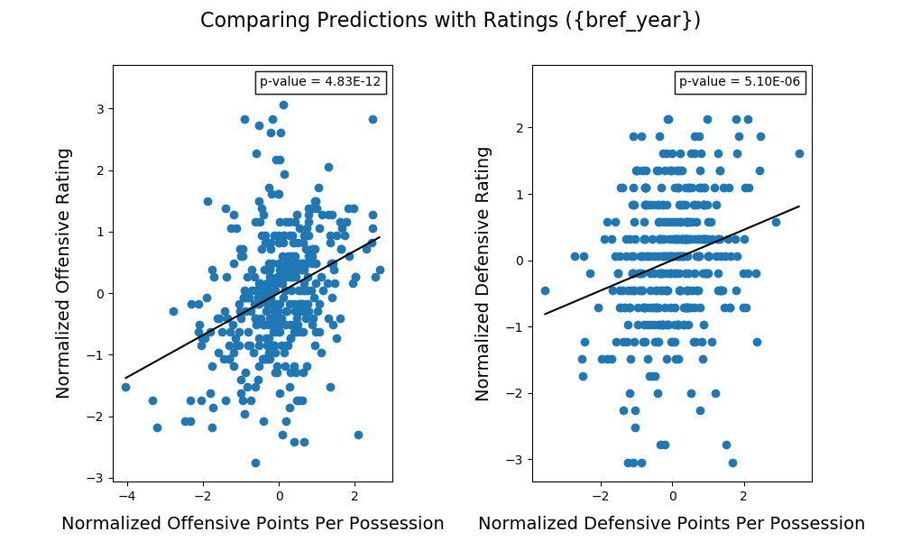
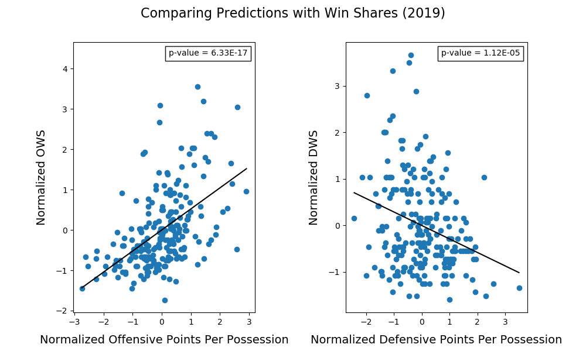
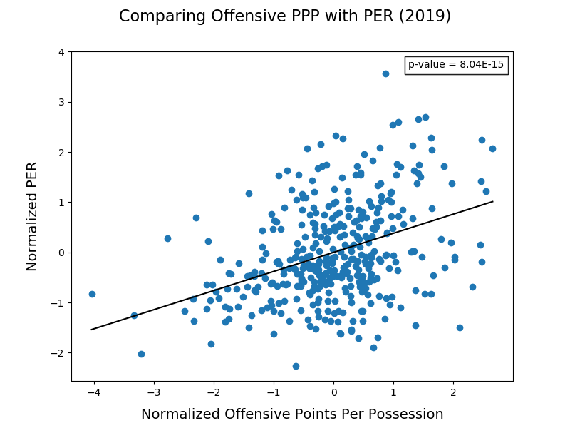

# The NBA Factory Machine

A framework built on training [factorization machines](https://www.csie.ntu.edu.tw/~b97053/paper/Rendle2010FM.pdf) (FMs) to learn about NBA players and their contributions to points per possession (PPP). Trained FMs can then predict how individual players or sets of players influence PPP. There are endless possibilities to explore with this framework. Feel free to comment, test, and share.  

## Overview

Play-by-play data is first formatted into sparse possession results that looks like this:

.

Each row is a group of (5) offensive players, (5) defensive players, and other possible factors (like quarter or home team) along with the group's average points per possession (PPP). FMs are trained on this sparse possession data to learn how all factors contribute to PPP. The trained FMs can then be used to predict PPP for different combinations of factors, like offensive and defensive players. 

### Case 1: Individual Predictions
 
The simplest case is predicting single offensive and defensive players. If only one player is selected, the FMs predict how much that player's presence alone influences PPP. The ideal player would have the highest PPP on offense and the lowest PPP on defense --- bottom right of these interactive plots below. The size of the points are relative to the player's number of possessions. The FMs can better learn about players with more possession data, so there's likely more confidence in larger points.  

The individual offensive and defensive PPP for all seasons between 2008 and 2019:

<iframe src="imgs/player_ppp_2008-2019.html"
    width="100%"
    height="550"
    scrolling="no"
    seamless="seamless"
    frameborder="0">
</iframe>  

Results for each season can be found here:

|   Season                                    |   Season                                    |
|  --------                                   |  --------                                   |
| [2008-2009](imgs/player_ppp_2008-2009.html) | [2014-2015](imgs/player_ppp_2014-2015.html) |
| [2009-2010](imgs/player_ppp_2009-2010.html) | [2015-2016](imgs/player_ppp_2015-2016.html) |
| [2010-2011](imgs/player_ppp_2010-2011.html) | [2016-2017](imgs/player_ppp_2016-2017.html) |
| [2011-2012](imgs/player_ppp_2011-2012.html) | [2017-2018](imgs/player_ppp_2017-2018.html) |
| [2012-2013](imgs/player_ppp_2012-2013.html) | [2018-2019](imgs/player_ppp_2018-2019.html) |
| [2013-2014](imgs/player_ppp_2013-2014.html) | [All](imgs/player_ppp_2008-2019.html)       |

Visually, =these individual PPP contributions seem to make sense; but more importantly, they comply with other basketball metrics. 

### Case 2: Comparing Existing Analytics

There are significant correlations between PPP and [Offenseive](https://en.wikipedia.org/wiki/Offensive_rating) and [Defensive](https://en.wikipedia.org/wiki/Defensive_rating) ratings.

Individual offensive and defensive PPP strongly correlate with Offensive and Defensive [Win Shares](https://en.wikipedia.org/wiki/Win_Shares), respectively. The defensive metrics negatively correlate because larger Win Shares and lower defensive PPP are better.

And there's also a strong correlation between individual offensive PPP and [PER](https://en.wikipedia.org/wiki/Player_efficiency_rating).  

So these individual PPP predictions capture the same information as other basketball metrics. But unlike these other metrics, this framework can be extended to measure the interactions between players.

### Case 2: Tandem Predictions

The next simplest case is when only two offensive or two defensive players are selected for prediction. The results represent how the duo together influence PPP. Again, ideal pairings have higher predicted offensive PPP and lower predicted defensive PPP (bottom right of theis interactive plots).

These are the offensive and defensive PPP for pairing of players in the 2018-2019 season:

<iframe src="imgs/tandem_ppp_2018-2019.html"
    width="100%"
    height="550"
    scrolling="no"
    seamless="seamless"
    frameborder="0">
</iframe>

Other season results are here:

|   Season                                    |   Season                                    |
|  --------                                   |  --------                                   |
| [2008-2009](imgs/tandem_ppp_2008-2009.html) | [2014-2015](imgs/tandem_ppp_2014-2015.html) |
| [2009-2010](imgs/tandem_ppp_2009-2010.html) | [2015-2016](imgs/tandem_ppp_2015-2016.html) |
| [2010-2011](imgs/tandem_ppp_2010-2011.html) | [2016-2017](imgs/tandem_ppp_2016-2017.html) |
| [2011-2012](imgs/tandem_ppp_2011-2012.html) | [2017-2018](imgs/tandem_ppp_2017-2018.html) |
| [2012-2013](imgs/tandem_ppp_2012-2013.html) | [2018-2019](imgs/tandem_ppp_2018-2019.html) |
| [2013-2014](imgs/tandem_ppp_2013-2014.html) | [All](imgs/tandem_ppp_2008-2019.html)       |

Only duos with the most possessions are shown because there are too many possible combinations to plot. 

### More Cases

There are lots of avenues to explore with this framework, like: 
- predicting the best trio, or lineup 
- finding who'd best fill a lineup spot 
- examining the latent variables of the FMs 
- correlating individual PPP with team success 
- adding more factors, like quarter and home/away
- better investigating the training parameters (this is the most important, but boring)
- projecting players from seasonal PPP values (I'm thinking [CARMELO](https://projects.fivethirtyeight.com/carmelo/) with this framework).  
- etc. . .

## Some Technical Details   

In essence, basketball is played between two teams of five players, with each team trying to score on their offensive possessions &mdash; and so it should be modelled as such. Current basketball analytics attempt to quantify player contributions with long contentious formulas (e.g. [PER](https://en.wikipedia.org/wiki/Player_efficiency_rating), [Win Shares](https://en.wikipedia.org/wiki/Win_Shares)) focused on specific stats, like field goals and steals. Instead, the focus should be on what's important: the result of a possession and not hand-tailoring formulas to measure [latent](https://en.wikipedia.org/wiki/Latent_variable) variables &mdash; computers are much better at calculating latent features.  

Multiple FMs are cross-validated and trained on sparse possession data with different parameter settings. The loss from the cross-validations are used as weights in combining the predicted results of the multiple FMs. 

More details can be found in the Python scripts within the GitHub repo. To run an experiment, start by setting up a Conda environment from the *environment.yaml* file. The *main.py* script reads from *params.py* and performs an experiment. Only *params.py* needs to change for new experiments. 

The data comes from [eightthiryfour](https://eightthirtyfour.com/). Their extended play-by-play datasets contain all players on the floor at all times and made this project much easier to start. 

