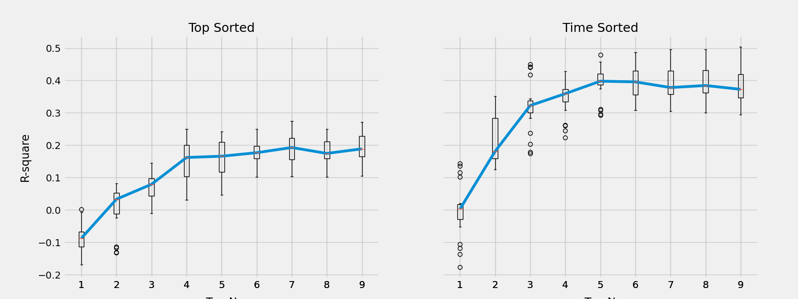
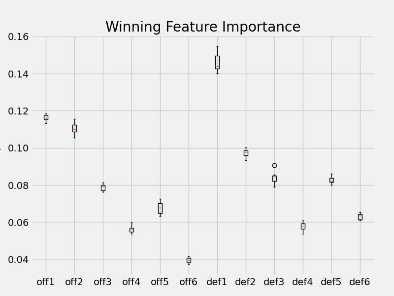
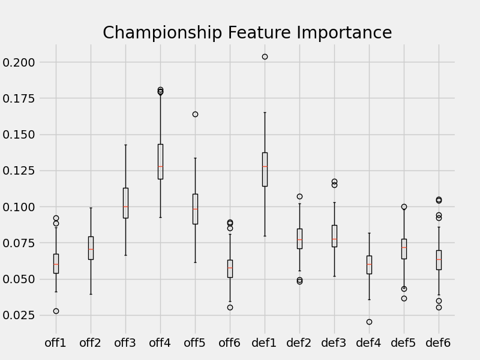

# NBA FACTORIZATION MACHINES

Quantifying the offensive and defensive contribution of NBA players with factorization machines (FMs). From play-by-play data, lineups and points scored per second are extracted. An ensemble of regression FMs are trained on the lineup data to learn individual offensive and defensive latent variables. The model form looks like:

The scripts contain more information.

## Individual Contributions

Created from running `contribution.py`

Predictions from the FMs are used to isolate each player's offensive and defensive contributions, a measure of points per minute in a statistically controlled game. Ideal players have higher offensive values (more points scored, x-axis) and lower defensive values (less scored on, y-axis). See these links for interactive hover plots. The dropdown menu can select individual teams, which might be more informative.

[2000-01](https://jpleet.github.io/nba-factory/data/plots/contribution/2000-01.html), 
[2001-02](https://jpleet.github.io/nba-factory/data/plots/contribution/2001-02.html), 
[2002-03](https://jpleet.github.io/nba-factory/data/plots/contribution/2002-03.html), 
[2003-04](https://jpleet.github.io/nba-factory/data/plots/contribution/2003-04.html), 
[2004-05](https://jpleet.github.io/nba-factory/data/plots/contribution/2004-05.html), 
[2005-06](https://jpleet.github.io/nba-factory/data/plots/contribution/2005-06.html), 
[2006-07](https://jpleet.github.io/nba-factory/data/plots/contribution/2006-07.html), 
[2007-08](https://jpleet.github.io/nba-factory/data/plots/contribution/2007-08.html), 
[2008-09](https://jpleet.github.io/nba-factory/data/plots/contribution/2008-09.html), 
[2009-10](https://jpleet.github.io/nba-factory/data/plots/contribution/2009-10.html), 
[2010-11](https://jpleet.github.io/nba-factory/data/plots/contribution/2010-11.html), 
[2011-12](https://jpleet.github.io/nba-factory/data/plots/contribution/2011-12.html), 
[2012-13](https://jpleet.github.io/nba-factory/data/plots/contribution/2012-13.html), 
[2013-14](https://jpleet.github.io/nba-factory/data/plots/contribution/2013-14.html), 
[2014-15](https://jpleet.github.io/nba-factory/data/plots/contribution/2014-15.html), 
[2015-16](https://jpleet.github.io/nba-factory/data/plotscontribution/2015-16.html), 
[2016-17](https://jpleet.github.io/nba-factory/data/plots/contribution/2016-17.html), 
[2017-18](https://jpleet.github.io/nba-factory/data/plots/contribution/2017-18.html), 
[2018-19](https://jpleet.github.io/nba-factory/data/plots/contribution/2018-19.html)

Throughout a season, there's more lineup pairings between teammates than opposing players, so the FMs get more team information and likely better learn interactions between teammates, making these predicted contribution values probably more encompassing of team dynamics, which might explains why some non-All-Stars stand out. 

## Individual Contributions and Team Success

This section explores individual contributions and team dynamics, like winning in regular season and playoffs.

### Team Aggregate

Created from running `contribution_aggregate_success.py`

Starting simple, the offensive and defensive contribution per team are aggregated and plotted with winning rates (_wins/games_). 

| Team Offensive Aggregation | Team Defensive  Aggregation | Plot                                                                                                  |
|----------------------------|-----------------------------|-------------------------------------------------------------------------------------------------------|
| Max                        | Min                         | [Max-Min](https://jpleet.github.io/nba-factory/data/plots/aggregate_success/max_min.html)             |
| Median                     | Median                      | [Median-Median](https://jpleet.github.io/nba-factory/data/plots/aggregate_success/median_median.html) |
| Mean                       | Mean                        | [Mean-Mean](https://jpleet.github.io/nba-factory/data/plots/aggregate_success/mean_mean.html)         |

This is a good sanity check of the FMs. With Max-Min aggregation, there's no clear visual pattern with team winning rates &mdash; the best a team has to offer alone doesn't seem to affect winning. Similar with Median-Median, the middle contribution of a team, like the 4th-6th man, alone doesn't seem to have a strong impact winning. But there are clear strong patterns with Mean-Mean: the center of a team's contribution mass does correlate with winning. Teams with overall better individual offensive and defensive contributions win more, passing the sanity check.

### Team Top Contributions

Created from running `contribution_top_success.py`

Investigating the importance of specific individual contributions on winning. The prediction data is formatted as:

| team          | off1 | off2 | ... | offN | def1 | def2 | ... | defN | win rate      | 
|---------------|-----------------|-----------------|-----|-----------------|-----------------|-----------------|-----|-----------------|---------------|
| t1 | o11  | o12   | ... | o1N   | d11  | d12   | ... | d1N   | w1 |
| t2 | o21  | o22   | ... | o2N   | d21  | d22   | ... | d2N   | w2 |

There are different ways to arrange a team's offensive (_off_) and defensive (_def_) values. One way is taking the sorted N-highest offensive and N-lowest defensive values, though this might be skewed by garbage bench player time. Or, the offensive and defensive spots can be allocated by time: the first spot to the player with the most playing time, next most is second, up until _N_ most played spots are filled.  

Either way the values are organized, regression models (boosted trees) with *win_rate* as the target and the top-N arranged offensive an defensive contributions as the predictors are cross-validated and the mean R2 scores are plotted against varying *N* (sample size=566). 

    

    
Some takeways from this cross-validation test:
- the model makes the best winning predictions with 6+ player contributions considered
- there isn't much gain with more than 6 players in the model
- arranging by time played is more informative, has better prediction power
- the contribution values of 6+ players explains a lot (over 40%) of the variance in winning

The next test focuses on the best parameters: the time-sorted contributions of 6 players. Random forest regression models are fit on winning rates to get the feature importance of each time position.

The contribution of the most playing player (*off1* and *def1*) has the most importance on winning. This makes sense: if they're playing the most, it's because the coach thinks they offer the best chance to win. The offense of the second most playing player also seems to have more importance on winning. The other time positions, the second most defense and all others, don't seem to have as strong nor different impact on winning. 

Taking this one step further, instead of predicting the winning rate with the top-6 time-sorted contributions, a random forest classifier can tease apart contributions between championship and non-championship teams. This is imblanaced data (19/566) and special imbalanced random forest classifiers are trained on different subsets of the data.
    

The defensive contribution of regular season winning and championship winnnig follow a similar pattern: the most playing player has the most importance influence, while the rest are not too different and not as important. Interestingly, the offensive contribution of regular season winning and championship winning are different: the offensive contribution of 3rd, 4th, and 5th players are most important in predicting a championship win.  

## Teammates

TO DO: Who are good teammates? Maybe look where player1 + player2 > max(player1, player2) 