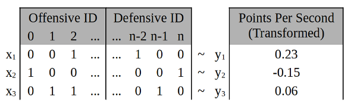

# NBA FACTORIZATION MACHINES

## Introduction

Training factorization machines (FMs) to quantifying the offensive and defensive contribution of NBA players. Play-by-play data is transformed into sparse lineup points that look like this:

An ensemble of FMs are trained on the lineup data to learn how individual offensive and defensive presence affects points scored. Predictions with the trained FMs are used to isolate each player's offensive and defensive contributions. Better players have higher offensive contributions (more points scored) and lower defensive contributions (less scored on). The notebooks contain more information.

## Season Results



## 2018-19 Best Tandems